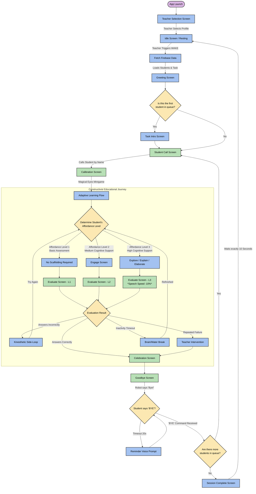

# Akshi Robot: Comprehensive User Experience (UX) Diagram

This document outlines the complete, end-to-end user experience and logical flow of the Akshi Robot during a standard classroom session. It is designed to be easily presented and explains exactly how the robot dynamically reacts to teachers and students, with a detailed breakdown of the internal Constructivist & Affordance pathways.

## Visual Flowchart

---

## Step-by-Step Explanation for Presentation

### 1. Startup & Standby
When the robot is turned on, the teacher selects their profile on the **Teacher Selection Screen**. The robot immediately goes to sleep on the **Idle Screen**, waiting patiently so it doesn't interrupt the classroom.

### 2. Waking & Fetching
When the teacher is ready, they trigger the `WAKE` command. The robot connects to Firebase, downloads the newest lesson plan, shuffles the list of students, and transitions to the **Greeting Screen** to say hello to the class.

### 3. The Student Loop
*   **Task Intro & Calling:** If it's the very first student, the robot explains the rules of the game (**Task Intro**). It then calls the specific student's name to come forward (**Student Call**).
*   **Calibration:** The robot plays a "Magical Eyes" game to lock its camera onto the student's face.
*   **The Constructivist Journey (Adaptive Routing):** The robot dynamically determines the student's needs and routes them to the correct Affordance Level:
    *   **Level 1:** Directly evaluates the student with no scaffolding.
    *   **Level 2:** The student interacts with the **Engage Screen** before being evaluated.
    *   **Level 3:** The student receives maximum cognitive support, moving through the **Explore, Explain, and Elaborate Screens**. During evaluation, the robot's speaking speed is slowed down by 10% to ensure high comprehension.
*   **Evaluation Outcomes:**
    *   *Correct:* Immediate transition to the Celebration Screen.
    *   *Incorrect:* The robot launches a **Kinesthetic Side-Loop** (physical movement break) to help them reset before trying again.
    *   *Repeated Failure:* The robot triggers **Teacher Intervention**.
*   **Handoff:** The robot praises the student on the **Goodbye Screen** and waits for the student to say "Bye". If they forget, it gently reminds them every 20 seconds. 

### 4. Queue Management & Reset
Once the student says "Bye", the robot checks its internal queue. If there are more students, it immediately calls the next name. If the entire class has finished the lesson, the robot goes to the **Session Complete Screen**, cheers for 10 seconds, and automatically puts itself back to sleep on the **Idle Screen** until the next lesson.