# Detailed Ginglu Robot Interaction Architecture

This document provides a low-level, granular view of the robot's logic, timing, and state transitions.

## 1. Core Logic Overview (ASCII Diagram)
*This diagram works in any text editor.*

```text
[ TEACHER SETUP ]
       |
       v
[ STUDENT SELECT ] <-------------------------------------------+
       |                                                       |
       v                                                       |
[ TASK INTRO ] (First Student Only)                            |
       |                                                       |
       v                                                       |
[ CALIBRATION ] <------------------------------------------+   |
       |  (IPC: calibration_command.json)                   |   |
       v                                                    |   |
[ EVALUATE L1 ] <---------------------------------------+   |   |
       |                                                |   |   |
       +---(Success)---->[ CELEBRATION ]----------------|---|---+
       |                                                |   |
       +---(1st Fail)--->[ KINESTHETIC ]----------------+   |
       |                    |                               |
       |               (2nd Fail)                           |
       |                    v                               |
       +---(Timeout)---->[ WATER BREAK ]--------------------+
       |
       +---(Final Fail)-->[ ENGAGE ] (Scaffolding Phase)
                            |
                            v
                      [ EVALUATE L2 ]
                            |
           +----------------+----------------+
           |                |                |
       (Success)         (Fail)          (Timeout)
           |                |                |
           v                v                v
     [CELEBRATION]      [EXPLORE]      [RABBIT BREAK]
                            |                |
                            v                +----(Resume)----> [EVALUATE L2]
                      [ EVALUATE L3 ]
                            |
           +----------------+----------------+
           |                |                |
       (Success)         (Fail)          (Timeout)
           |                |                |
           v                v                v
     [CELEBRATION]      [EXPLAIN]         [SKIP] ----------> [NEXT STUDENT]
                            |
                            v
                      [ EVALUATE L3 ]
                            |
                         (Fail)
                            |
                            v
                       [ELABORATE]
                            |
                            v
                      [ EVALUATE L3 ]
                            |
                         (Fail)
                            |
                            v
                 [ TEACHER INTERVENTION ]
```

## 2. Granular State Transitions (Mermaid)

```mermaid
stateDiagram-v2
    [*] --> IDLE
    IDLE --> TEACHER_SELECT : Press 'W'
    
    state TEACHER_SELECT {
        [*] --> SelectTeacher
        SelectTeacher --> LoadRoster : Keys A/B/C
    }

    TEACHER_SELECT --> SESSION_START
    
    state SESSION_START {
        [*] --> StudentCall
        StudentCall --> Calibration : "Magical Eyes Game"
    }

    state Calibration {
        [*] --> OpenEyes : "Make eyes BIG"
        OpenEyes --> CloseEyes : "Sleeping bunny"
        CloseEyes --> Done : "Charged up!"
    }

    Calibration --> ADAPTIVE_FLOW

    state ADAPTIVE_FLOW {
        state IDENTIFYING {
            direction TB
            EvalL1 --> Kinesthetic : 1st Wrong
            Kinesthetic --> EvalL1 : Pass
            Kinesthetic --> Engage : Fail
            
            Engage --> EvalL2
            EvalL2 --> Explore : Wrong
            Explore --> EvalL3a
            
            EvalL3a --> Explain : Wrong
            Explain --> EvalL3b
            
            EvalL3b --> Elaborate : Wrong
            Elaborate --> EvalL3c
            
            EvalL3c --> TeacherIntervention : Wrong
        }

        state CONFIRMING {
            Confirm1 --> Confirm2 : Correct
            Confirm2 --> ADVANCING : Correct
            Confirm1 --> IDENTIFYING : Wrong
            Confirm2 --> IDENTIFYING : Wrong
        }

        state ADVANCING {
            TryHarderLevel --> CONFIRMING : Correct
            TryHarderLevel --> IDENTIFYING : Wrong
        }
    }

    ADAPTIVE_FLOW --> CELEBRATION : Correct Answer
    CELEBRATION --> SESSION_COMPLETE : Queue Empty
    CELEBRATION --> SESSION_START : Queue Not Empty
    SESSION_COMPLETE --> IDLE
```



## 3. The "Evaluate" Screen Internal Logic
Each `Evaluate` screen (L1, L2, L3) runs a complex internal timer and input loop:

### Timer Behavior:
*   **T=0s**: Screen Loads. Robot speaks Intro + Question.
*   **T=Speech End**: Sequential presentation begins. Robot highlights Option 1 and asks "Is this your answer? Say yes or no."
*   **T=60s**: **Motivation Nudge**. Robot speaks encouraging phrase if no answer.
*   **T=180s**: **Hard Timeout**.
    *   **Level 1**: Redirects to `water_break_screen.py`.
    *   **Level 2**: Redirects to `break_screen.py` (Rabbit Jump).
    *   **Level 3**: Auto-skips to Next Student.

### Sequential Interaction:
The child does not press 1, 2, 3, or 4. They respond to a "Dialogue Loop":
1.  **Robot**: Highlights Option A. "Is this your answer? Yes or no?"
2.  **Input**:
    *   If **YES**: Logic checks if Option A is correct.
    *   If **NO**: Robot moves to Option B. "Is this your answer? Yes or no?"
3.  **Exhaustion**: If the child says NO to all options, the system treats it as an **Incorrect Answer** and enters the failure cascade.

## 4. Hardware IPC Protocol
The main Python application communicates with the robot's lower-level scripts (`ginglu-the-robot/`) via JSON files:

| File | Direction | Purpose |
| :--- | :--- | :--- |
| `calibration_command.json` | UI -> Robot | `start_session`, `pause_frames`, `resume_frames`, `end_session` |
| `calibration_state.json` | Robot -> UI | `calibration_status` (e.g., "Keep eyes OPEN (45/200)") |
| `websocket.py` | Bi-di | Sends telemetry to Firebase and receives remote commands. |

## 5. Persistence & Firebase
*   **Firestore**: Logs the full `path_taken` (e.g., `["evaluate_L1", "kinesthetic", "engage", "evaluate_L2"]`).
*   **Realtime DB**: Stores the `identified_phase` for every student.
*   **State Persistence**: If a student is identified as needing "Engage" support, they will start their next round directly at that level, skipping L1.
