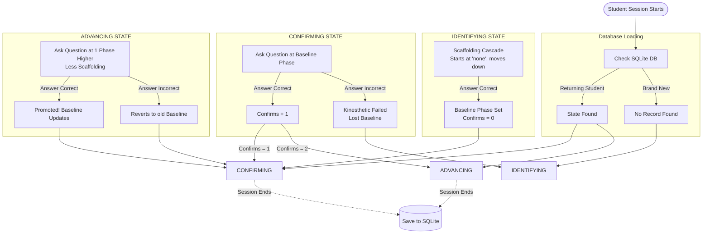

# Student Cognitive Improvement Model (Vygotsky's Scaffolding)

This document maps out the algorithm the robot uses to track, adapt to, and actively improve a student's cognitive independence across multiple sessions. This is powered by an SQLite database that securely remembers the student's cognitive state across days and weeks.

## The Cognitive Scaffolding Ladder
The robot ranks the scaffolding it provides from highest support to lowest support. As the student improves, the robot actively *removes* scaffolding to build their independence.

1.  **`elaborate`** (Maximum Scaffolding / Affordance L3)
2.  **`explain`** (High Scaffolding / Affordance L3)
3.  **`explore`** (Moderate Scaffolding / Affordance L3)
4.  **`engage`** (Low Scaffolding / Affordance L2)
5.  **`none`** (Zero Scaffolding / Direct Evaluation L1)

---

## The Dynamic Progression Algorithm

---

## Detailed Example: How a Student Improves

Let's walk through an example of a student named **Leo** interacting with the robot across multiple rounds/days.

1.  **Round 1 (Identifying):** 
    Leo is a brand new student. The robot starts with no scaffolding (`none`). Leo fails. The robot adds support (`engage`). Leo fails. The robot adds more support (`explore`). Leo gets it right!
    *   **Action:** The database saves Leo's baseline phase as `explore`. The state becomes **CONFIRMING**.

2.  **Round 2 (Confirming - Day 1):** 
    The robot loads Leo's profile. Since he is in the **CONFIRMING** state, it gives him a task at the `explore` phase. Leo gets it right.
    *   **Action:** `baseline_confirms` becomes `1/2`.

3.  **Round 3 (Confirming - Day 2):** 
    The robot gives Leo another task at the `explore` phase. Leo gets it right again.
    *   **Action:** `baseline_confirms` hits `2/2`. Leo has proven mastery of this level! His state is upgraded to **ADVANCING**.

4.  **Round 4 (Advancing - Day 3):** 
    Because Leo is **ADVANCING**, the robot intentionally *removes* a layer of scaffolding. It gives him a harder task at the `engage` phase (1 level higher than `explore`).
    *   *Scenario A (Success):* Leo gets it right! He is officially **Promoted**. His new baseline becomes `engage`, and he drops back to **CONFIRMING** (0/2) to master this new level.
    *   *Scenario B (Failure):* Leo gets it wrong. That's okay! He just isn't ready for reduced scaffolding yet. The robot drops his state back to **CONFIRMING** at his old `explore` baseline to give him more practice next time.