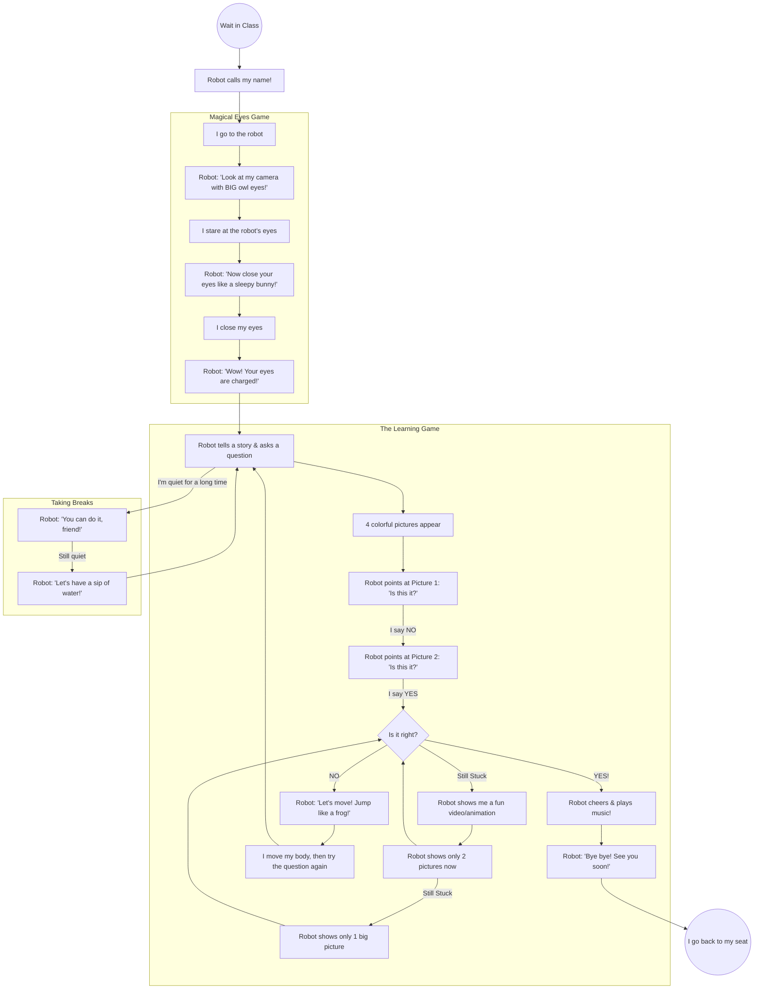

# The Student's Journey with Ginglu

This document maps the interaction from the **student's perspective**. It describes what the child sees, hears, and does during their time with the robot.

## 1. The Interaction Narrative (Visual Flow)

## 2. Phase-by-Phase Experience

### Phase 1: The "Call to Action"
*   **What I hear:** My name being called across the room in a friendly voice.
*   **What I see:** The robot's eyes looking for me.
*   **My role:** I walk up to the robot and get ready to play.

### Phase 2: The Magical Eyes Game (Calibration)
*   **The Story:** The robot needs to "charge" its magical eyes by looking at mine.
*   **The Game:** I play "Owl" (big eyes) and "Bunny" (closed eyes).
*   **The Feeling:** It's a fun, low-pressure game that helps me get comfortable with the robot's camera.

### Phase 3: The Story & Question (Evaluation)
*   **The Content:** The robot tells me a short story or explains a concept using big, bright images.
*   **The Interaction:** I don't have to touch anything. The robot asks "Is this it?" for each picture.
*   **How I answer:** I simply say "Yes" or "No" (or a teacher helps press the keys).

### Phase 4: The Support Layers (When it's hard)
If I get a question wrong, the robot doesn't say "Wrong." Instead, the experience changes:
1.  **"Let's Move"**: If it's my first mistake, we do a quick physical game (like jumping or waving) to wake up my brain.
2.  **"Watch This"**: If I'm still stuck, the robot shows me a fun "Engage" video to help me understand better.
3.  **"Making it Easier"**: The robot hides the wrong pictures so I only have to choose between 2 (or even just look at 1).

### Phase 5: The Celebration
*   **What happens:** When I get it right, the robot's eyes turn into stars or hearts!
*   **The Reward:** Fun music plays, and the robot tells me how amazing I am.
*   **The Exit:** I feel proud, say goodbye, and the robot calls the next friend.

## 3. What happens if I get tired?
*   **The Nudge:** If I stop answering, the robot gently encourages me by name.
*   **The Break:** If I seem really tired, the robot suggests a "Water Break" or a "Rabbit Jump" to help me reset.
*   **The Teacher:** If I'm really struggling, the robot politely asks the teacher to come and help us together.
