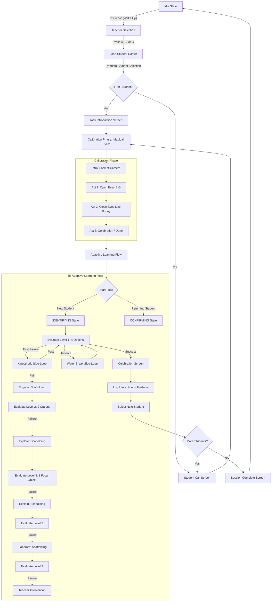

# Ginglu Robot User Interaction Flow

This document provides a comprehensive overview of the Ginglu robot's user interaction flow, from the initial idle state to the adaptive learning sessions with students.

## High-Level State Diagram

The following diagram illustrates the primary phases of the robot's operation and the transitions between them.

## Detailed Phase Breakdown

### 1. Idle & Setup
The robot starts in an **Idle** state with sleeping eyes.
- **Wake Up**: The teacher presses `W` to wake the robot.
- **Teacher Selection**: The robot displays available teachers. The teacher selects their profile using mapped keys (`A`, `B`, etc.).
- **Data Sync**: The system fetches the student roster and available tasks from Firebase.

### 2. Introduction & Calibration
- **Task Intro**: If it's the first student of the session, the robot explains the overall task.
- **Student Call**: The robot randomly selects a student and calls them by name.
- **Magical Eyes (Calibration)**: To ensure the robot can "see" the child properly, it plays a mini-game:
    1.  **Open Eyes**: Asks the child to look at the camera with "big owl eyes."
    2.  **Close Eyes**: Asks the child to close their eyes like a "sleepy bunny."
    3.  **Done**: Confirms calibration and prepares for the task.

### 3. Adaptive Learning Loop (The 5E Model)
This is the core "brain" of the robot. It uses **Adaptive Affordance** to adjust difficulty dynamically.

#### Progression States:
- **IDENTIFYING**: The robot is testing to see which support level the child needs.
- **CONFIRMING**: Once a child passes at a certain level, the robot asks two more questions at that level to confirm mastery.
- **ADVANCING**: After confirming mastery, the robot tries a slightly harder level (less scaffolding) in the next round.

#### The Cascade (IDENTIFYING State):
If a child fails, the robot provides **more** help (scaffolding) and **fewer** choices:
1.  **Evaluate L1**: 4 choices.
2.  **Engage/Explore/Explain/Elaborate**: Educational screens that teach the concept.
3.  **Evaluate L2/L3**: 2 choices or 1 choice (focal object) to simplify the task.

#### Special Interaction Loops:
- **Kinesthetic**: If the child fails for the first time at any level, the robot suggests a physical movement/game to reset their focus.
- **Water Break**: Triggered if the child times out on Level 1, suggesting they take a sip of water.
- **Teacher Intervention**: If the child fails all levels of support, the robot politely asks for the teacher's help.

### 4. Logging & Completion
- **Firebase Logging**: Every attempt, success, timeout, and path taken is logged to Firestore for teacher review.
- **Session Complete**: Once all students in the roster have completed a task round, the robot celebrates and returns to the Idle state.

## Key Interaction Controls (Keyboard)
*   `W`: Wake up.
*   `A, B, C, D`: Select answers / Teacher selection.
*   `S`: Skip current student.
*   `Space`: Take a break.
*   `Esc`: Quit/Emergency stop.
