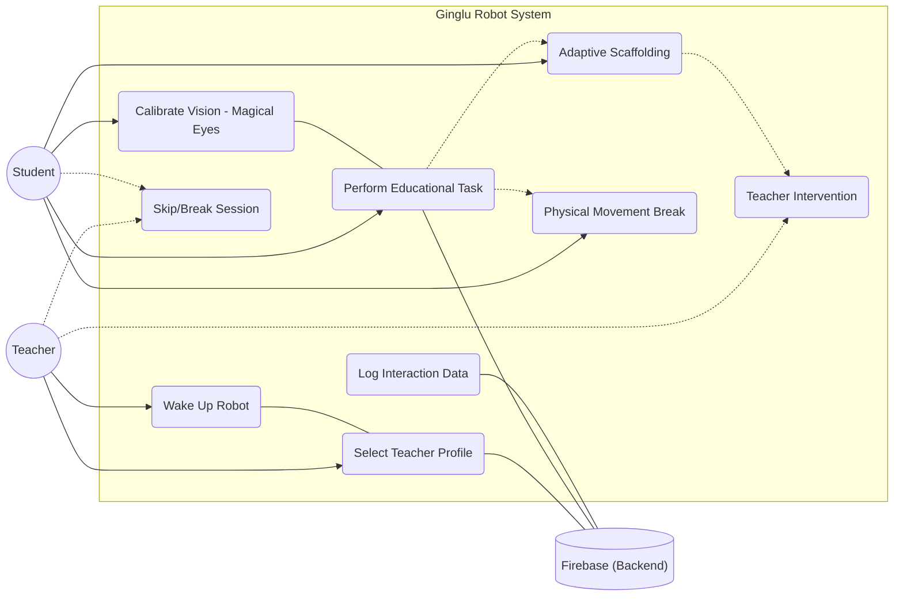

# Ginglu Robot Use Case Diagram

This diagram outlines the primary actors and their interactions with the Ginglu Robot system.

## Description of Use Cases

### 1. Wake Up Robot (Teacher)
The teacher initiates the session by pressing a physical key (e.g., 'W'). The robot transitions from an Idle/Sleeping state to an active state.

### 2. Select Teacher Profile (Teacher)
The teacher selects their name from a list fetched from **Firebase**. This loads the correct student roster for that specific classroom.

### 3. Calibrate Vision - Magical Eyes (Student)
The student participates in a mini-game (Open/Close eyes) that allows the robot's computer vision system to calibrate for that specific child's height and facial features.

### 4. Perform Educational Task (Student)
The core interaction where the student answers questions via the "Yes/No" dialogue loop. The robot tracks accuracy and response time.

### 5. Adaptive Scaffolding (Student)
If the student struggles, the system automatically triggers this use case. It provides simpler visuals (2 choices vs 4) and educational content (Engage/Explore/Explain/Elaborate videos).

### 6. Physical Movement Break (Student)
Triggered on a first-time failure. The robot leads the student through a kinesthetic activity (e.g., jumping like a rabbit) to maintain engagement.

### 7. Teacher Intervention (Teacher)
If the student fails all adaptive levels, the robot politely requests the Teacher's assistance. The teacher resolves the learning block and manually continues the session.

### 8. Skip/Break Session (Teacher/Student)
Allows the session to be paused (Break) or the current student to be moved to the end of the queue (Skip).

### 9. Log Interaction Data (System)
The system automatically logs every decision, time-on-task, and affordance level reached to **Firebase** for later analysis by educators.
