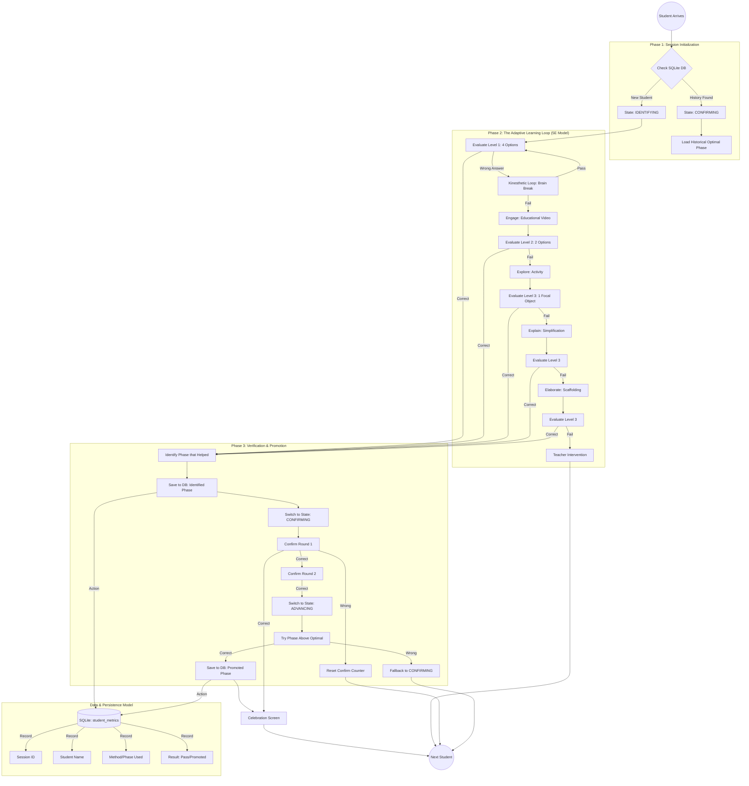

# Ginglu Robot: Comprehensive User Flow & Adaptive Logic

This diagram illustrates the end-to-end journey of a student interacting with the Ginglu robot, including the adaptive 5E learning model, data persistence, and the multi-stage verification algorithm.

## Detailed System Logic Breakdown

### 1. Identifying the "Optimal Phase"
When a **New Student** starts, the robot enters the `IDENTIFYING` state. It runs the **5E Cascade**:
*   The robot starts at the hardest level (`Evaluate L1`).
*   If the student fails, it provides more support (Engage → Explore → Explain → Elaborate).
*   The moment the student answers correctly, the robot **Identifies** which support phase was active.
*   **Database Action:** This "Identified Phase" is saved to the SQLite `student_metrics` table as the student's new baseline.

### 2. Two-Stage Verification (`CONFIRMING`)
Once a phase is identified, the robot doesn't immediately try to make the task harder. It must first **Verify** mastery.
*   The student enters the `CONFIRMING` state.
*   The student must answer **2 consecutive questions correctly** at their identified phase in future rounds.
*   If they fail any of these two "Confirmation Rounds," the counter resets to zero, and they stay at that level.

### 3. The Advancement Staircase (`ADVANCING`)
After passing the 2-stage verification, the robot attempts to **Promote** the student.
*   The robot enters the `ADVANCING` state.
*   It serves a task using the **Phase Above** their current optimal one (e.g., if they were at `Engage`, it tries `None/Level 1`).
*   **Success:** If they pass, the new, harder phase is saved to the database as their optimal method.
*   **Failure:** If they fail, the robot realizes they aren't ready to move up and falls back to the `CONFIRMING` state for their previous level.

### 4. Returning Student Logic (Reusing Data)
When a student returns (`start_student_flow`):
1.  The `FlowController` queries the SQLite database for the student's last recorded `method_used`.
2.  If found, the robot **Skips the Identifying Cascade**.
3.  It immediately routes the student to their **Optimal Phase** and sets the state to `CONFIRMING`.
4.  This ensures the robot "remembers" exactly how much help each specific child needs.

### 5. The Kinesthetic "Brain Break"
Regardless of the student's history, the **first failure at any level** triggers the Kinesthetic loop. 
*   This is a physical reset (e.g., "Jump like a frog").
*   If they pass the physical game, they get **one retry** at the current evaluation.
*   If they fail the physical game, they drop to the next scaffolding phase (in `IDENTIFYING` state) or rotate to the next student (in `CONFIRMING` state).
